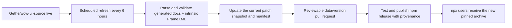

# WoW AddOn API MCP

A standalone, version-aware Model Context Protocol server for the World of Warcraft retail AddOn API. It ships pinned documentation snapshots inside the npm package, so users do **not** need VS Code, the `ketho.wow-api` extension, Lua, Git, WSL, or a live network connection after installation.

The archive contains retail patch snapshots from `10.0.0` onward, including Blizzard's secret-value and restricted-API metadata. Use `--dataset-info` for the bundled default build and `--list-versions` for the complete patch catalog. Every result identifies the selected patch and build so an LLM does not silently mix APIs from different versions.

## Install

Node.js 20 or newer is required. The easiest Codex setup is:

```shell
codex mcp add wow-addon-api -- npx -y wow-addon-api-mcp@latest
```

Verify it with `codex mcp list`, then restart any already-running Codex session that should use it.

For a project-local Codex configuration, add this on macOS or Linux:

```toml
[mcp_servers.wow-addon-api]
command = "npx"
args = ["-y", "wow-addon-api-mcp@latest"]
```

On Windows:

```toml
[mcp_servers.wow-addon-api]
command = "cmd"
args = ["/c", "npx", "-y", "wow-addon-api-mcp@latest"]
```

Save the file as `.codex/config.toml` in the project. The same stdio command works with Claude Desktop and other MCP clients:

```json
{
  "mcpServers": {
    "wow-addon-api": {
      "command": "npx",
      "args": ["-y", "wow-addon-api-mcp@latest"]
    }
  }
}
```

Use `"command": "cmd"` and prefix the arguments with `"/c"` on Windows if the client does not resolve `npx` directly.

## What it knows

- Global and `C_` namespace functions, methods, arguments, returns, and documentation
- Frame events and payloads
- Enumerations and structures
- Blizzard `ScriptObject` widgets under public names such as `Frame` and `Button`
- Public methods discovered from intrinsic FrameXML widgets such as `AuraContainer` and `AuraButton`
- Raw API constraints including `SecretArguments`, `HasRestrictions`, `RequiresUnitAuraAccess`, `ConditionalSecretContents`, `NeverSecret`, and related fields
- The exact upstream client build, commit, and source file for each snapshot
- Supplementary mainline source symbols, XML templates, mixins, named UI objects, and literal CVar/atlas references, with declaration/reference labels and source line links

The server exposes these tools:

| Tool | Purpose |
| --- | --- |
| `get_dataset_info` | Resolve a version and show its WoW build, upstream commit, and entry counts |
| `list_versions` | List every supported retail patch, build, date, and source commit |
| `lookup_api` | Exact lookup across functions, methods, events, enums, structures, widgets, and systems |
| `search_api` | Ranked name and official-documentation search |
| `get_namespace` | List a namespace's functions, events, and types |
| `get_widget_methods` | Show direct and inherited widget methods |
| `get_enum` | Show an enum and its values |
| `get_event` | Show an event and its payload |
| `search_restrictions` | Find security-, taint-, secret-, combat-, and aura-restricted APIs |
| `compare_api` | Compare one exact API between two retail patches |
| `diff_versions` | List added, removed, and structurally changed APIs, optionally by kind or namespace |
| `get_api_history` | Show when an exact API appeared, disappeared, or changed |
| `lookup_resource` | Find exact supplementary resource names and their source declarations/references |
| `search_resources` | Search supplementary resource names with category filters and pagination |
| `lookup_engine_api` | Read a separately attributed, build-reviewed community engine contract |
| `get_migration_guidance` | Read sourced guidance for a legacy API and target build |
| `lookup_runtime_resource` | Query an optional local snapshot for CVar defaults, atlas geometry, symbol types, or localized strings |

All single-version query tools accept an optional `version`. It can be a patch (`12.1.0` or `12.1`), full client version or build number returned by `list_versions`, or `latest`. Omitting it selects the manifest's current default.

Supplementary tools accept `query`, optional `kind` (`symbol`, `template`, `mixin`, `frame`, `cvar`, or `atlas`), `version`, `limit`, and `offset`. Follow `nextOffset` to retrieve more matches. For example, use `lookup_resource` with `query: "BackdropTemplate"` and `kind: "template"` to inspect inheritance and attached mixins.

All 26 bundled patches have supplementary resource archives. The 11 snapshots from `10.0.0` through `10.2.7` report partial coverage with explicit missing or ambiguous include paths; the 15 later snapshots have complete coverage of the selected source graph. Complete source extraction does not mean complete runtime coverage. Resource archives load separately on demand, so API history queries do not inflate them.

Definitions come from source, not execution: call-site references do not establish engine signatures or addon-safe access. Parameter names on Lua definitions do not establish types, optionality, or returns. XML child names containing `$parent` are patterns, and template children are not automatically instantiated global frames. CVar and atlas source results are usage references rather than complete registries or defaults. See [the source audit](docs/SOURCE_AUDIT.md) for scope and remaining gaps.

The curated layer documents `CreateFrame`, `hooksecurefunc`, `issecurevariable`, and `issecure`, plus `UnitAura` migration guidance. It applies only to reviewed build `12.1.0.69587`; future builds require another review. `lookup_api` uses an applicable curated contract when no exact generated API exists. Search, history, and diffs continue to describe generated documentation coverage, which does not prove runtime introduction or removal. Curated records include immutable source revisions, attribution, and their separate CC BY-SA 4.0 license.

## Optional local runtime observations

The package includes a small `WowApiSnapshot` addon for explicitly requested names. It collects CVar defaults and flags, atlas dimensions and UV coordinates, symbol types, and opt-in localized strings. It omits current CVar settings and does not enumerate all globals. Follow the [collector instructions](tools/WowApiSnapshot/README.md), save its JSON locally, and add the snapshot to your MCP command:

```shell
npx -y wow-addon-api-mcp@latest --runtime-data /absolute/path/snapshot.json
```

Alternatively set `WOW_API_RUNTIME_DATA` to that path. `lookup_runtime_resource` requires an exact catalog build match. Pass `locale` when the answer must match a particular locale; otherwise the response identifies the snapshot's locale. Results distinguish unrequested, missing, failed, and found names. They are observations from that client session, not guaranteed contracts or permission to redistribute captured content. No Ketho or Wago runtime dumps are bundled. The collector core is tested offline; its UI and game-specific behavior still require [in-client validation](docs/VALIDATION.md).

For an old-addon migration, a useful LLM workflow is:

1. Call `list_versions` and choose the closest source patch.
2. Use `compare_api` for APIs the addon already calls.
3. Use a namespace-filtered `diff_versions` to discover related changes.
4. Use `get_api_history` when documentation coverage changed, and `get_migration_guidance` for separately sourced replacement guidance.
5. Query the current patch normally and preserve all returned restriction metadata.

Check the installed data without starting an MCP session:

```shell
npx -y wow-addon-api-mcp@latest --dataset-info
npx -y wow-addon-api-mcp@latest --list-versions
```

## How freshness works



The parser evaluates a deliberately small, non-executing subset of Lua table syntax. It never runs Blizzard Lua. Builds fail if the source becomes structurally incompatible, shrinks unexpectedly, loses expected security metadata, or fails the MCP integration tests. The compressed snapshots are deterministic, so the refresh workflow opens a pull request only when pinned source content or provenance changes. A new patch adds a snapshot; a later build in the current patch replaces that patch's canonical snapshot without blending its entries with another version.

The official Blizzard documentation tables mirrored by Gethe are the API authority. The public widget-name conventions are adapted from [Ketho/vscode-wow-api](https://github.com/Ketho/vscode-wow-api), while the MCP query model was informed by [spartanui-wow/wow-api-mcp](https://github.com/spartanui-wow/wow-api-mcp). Neither project nor VS Code is required at build or runtime.

## Local development

```shell
npm ci
npm run data:update
npm test
npm run pack:check
```

`data:update` maintains an ignored checkout at `.cache/wow-ui-source`, rebuilds the current retail snapshot under `data/retail/` and its resource archive under `data/resources/`, and updates `data/manifest.json`. To build from an existing checkout instead:

```shell
node scripts/build-dataset.mjs --source /path/to/wow-ui-source
```

Maintainers can deterministically rebuild the historical archive from the upstream Git history:

```shell
npm run data:history
node scripts/build-history.mjs --from 11.0.0 --to 12.1.0
node scripts/build-history.mjs --pinned --resources --allow-partial-resources
```

History builds default to API-only and select the newest upstream source commit explicitly labeled for each retail patch family. `--pinned` uses existing manifest commits; `--resources` includes resource extraction. Partial resource extraction requires the explicit flag and records its gaps. See [CONTRIBUTING.md](CONTRIBUTING.md) for change guidance and [docs/PUBLISHING.md](docs/PUBLISHING.md) for the one-time npm/GitHub setup.

## Scope and attribution

This package targets retail patch families from 10.0.0 onward. It stores one canonical source snapshot per supported patch family, not every hotfix build. Classic-family datasets are not currently shipped. Community contracts are labeled separately from Blizzard documentation and do not override its restrictions. Code is Apache-2.0; curated documentation is CC BY-SA 4.0 with record-level attribution. Upstream Blizzard material retains its own rights; attribution is not a blanket redistribution grant.

World of Warcraft and Blizzard Entertainment are trademarks or registered trademarks of Blizzard Entertainment, Inc. This project is not affiliated with or endorsed by Blizzard Entertainment. See [THIRD_PARTY_NOTICES.md](THIRD_PARTY_NOTICES.md).
