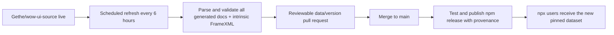

# WoW AddOn API MCP

A standalone Model Context Protocol server for the current World of Warcraft mainline AddOn API. It ships a pinned documentation dataset inside the npm package, so users do **not** need VS Code, the `ketho.wow-api` extension, Lua, Git, WSL, or a live network connection after installation.

The initial bundled dataset is built from WoW `12.1.0.69283` and includes Blizzard's 12.1 secret-value and restricted-API metadata. Scheduled releases advance that pin as mainline changes.

## Install

Node.js 20 or newer is required. The easiest Codex setup is:

```shell
codex mcp add wow-addon-api -- npx -y wow-addon-api-mcp@latest
```

Verify it with `codex mcp list`, then restart any already-running Codex session that should use it.

For a project-local Codex configuration, add this on macOS or Linux:

```toml
[mcp_servers.wow-addon-api]
command = "npx"
args = ["-y", "wow-addon-api-mcp@latest"]
```

On Windows:

```toml
[mcp_servers.wow-addon-api]
command = "cmd"
args = ["/c", "npx", "-y", "wow-addon-api-mcp@latest"]
```

Save the file as `.codex/config.toml` in the project. The same stdio command works with Claude Desktop and other MCP clients:

```json
{
  "mcpServers": {
    "wow-addon-api": {
      "command": "npx",
      "args": ["-y", "wow-addon-api-mcp@latest"]
    }
  }
}
```

Use `"command": "cmd"` and prefix the arguments with `"/c"` on Windows if the client does not resolve `npx` directly.

## What it knows

- Global and `C_` namespace functions, methods, arguments, returns, and documentation
- Frame events and payloads
- Enumerations and structures
- Blizzard `ScriptObject` widgets under public names such as `Frame` and `Button`
- Public methods discovered from 12.1 intrinsic FrameXML widgets such as `AuraContainer` and `AuraButton`
- Raw API constraints including `SecretArguments`, `HasRestrictions`, `RequiresUnitAuraAccess`, `ConditionalSecretContents`, `NeverSecret`, and related fields
- The exact upstream client build, commit, and source file for every generated release

The server exposes these tools:

| Tool | Purpose |
| --- | --- |
| `get_dataset_info` | Show the bundled WoW build, upstream commit, and entry counts |
| `lookup_api` | Exact lookup across functions, methods, events, enums, structures, widgets, and systems |
| `search_api` | Ranked name and documentation search |
| `get_namespace` | List a namespace's functions, events, and types |
| `get_widget_methods` | Show direct and inherited widget methods |
| `get_enum` | Show an enum and its values |
| `get_event` | Show an event and its payload |
| `search_restrictions` | Find security-, taint-, secret-, combat-, and aura-restricted APIs |

Check the installed data without starting an MCP session:

```shell
npx -y wow-addon-api-mcp@latest --dataset-info
```

## How freshness works



The parser evaluates a deliberately small, non-executing subset of Lua table syntax. It never runs Blizzard Lua. Builds fail if the source becomes structurally incompatible, shrinks unexpectedly, loses security metadata, or fails the MCP integration tests. The compressed dataset is deterministic, so the refresh workflow opens a pull request only when upstream content actually changes.

The official Blizzard documentation tables are the freshness authority. The public widget-name conventions are adapted from [Ketho/vscode-wow-api](https://github.com/Ketho/vscode-wow-api), while the MCP query model was informed by [spartanui-wow/wow-api-mcp](https://github.com/spartanui-wow/wow-api-mcp). Neither VS Code project is required at build or runtime.

## Local development

```shell
npm ci
npm run data:update
npm test
npm run pack:check
```

`data:update` maintains an ignored checkout at `.cache/wow-ui-source` and rebuilds `data/mainline.json.gz`. To build from an existing checkout instead:

```shell
node scripts/build-dataset.mjs --source /path/to/wow-ui-source
```

See [CONTRIBUTING.md](CONTRIBUTING.md) for change guidance and [docs/PUBLISHING.md](docs/PUBLISHING.md) for the one-time npm/GitHub setup.

## Scope and attribution

This package targets the current mainline/retail client. Classic-family datasets can be added later without changing the mainline schema, but are not currently shipped. Community wiki prose and historical/deprecated APIs are not treated as authoritative when they no longer appear in the current Blizzard source.

World of Warcraft and Blizzard Entertainment are trademarks or registered trademarks of Blizzard Entertainment, Inc. This project is not affiliated with or endorsed by Blizzard Entertainment. See [THIRD_PARTY_NOTICES.md](THIRD_PARTY_NOTICES.md).
