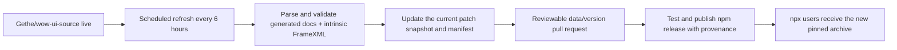

# WoW AddOn API MCP

A standalone, version-aware Model Context Protocol server for the World of Warcraft retail AddOn API. It ships pinned documentation snapshots inside the npm package, so users do **not** need VS Code, the `ketho.wow-api` extension, Lua, Git, WSL, or a live network connection after installation.

The archive currently contains 26 retail patch snapshots from `10.0.0` through `12.1.0`. The default dataset is WoW `12.1.0.69283` and includes Blizzard's secret-value and restricted-API metadata. Every result identifies the selected patch and build so an LLM does not silently mix APIs from different versions.

## Install

Node.js 20 or newer is required. The easiest Codex setup is:

```shell
codex mcp add wow-addon-api -- npx -y wow-addon-api-mcp@latest
```

Verify it with `codex mcp list`, then restart any already-running Codex session that should use it.

For a project-local Codex configuration, add this on macOS or Linux:

```toml
[mcp_servers.wow-addon-api]
command = "npx"
args = ["-y", "wow-addon-api-mcp@latest"]
```

On Windows:

```toml
[mcp_servers.wow-addon-api]
command = "cmd"
args = ["/c", "npx", "-y", "wow-addon-api-mcp@latest"]
```

Save the file as `.codex/config.toml` in the project. The same stdio command works with Claude Desktop and other MCP clients:

```json
{
  "mcpServers": {
    "wow-addon-api": {
      "command": "npx",
      "args": ["-y", "wow-addon-api-mcp@latest"]
    }
  }
}
```

Use `"command": "cmd"` and prefix the arguments with `"/c"` on Windows if the client does not resolve `npx` directly.

## What it knows

- Global and `C_` namespace functions, methods, arguments, returns, and documentation
- Frame events and payloads
- Enumerations and structures
- Blizzard `ScriptObject` widgets under public names such as `Frame` and `Button`
- Public methods discovered from intrinsic FrameXML widgets such as `AuraContainer` and `AuraButton`
- Raw API constraints including `SecretArguments`, `HasRestrictions`, `RequiresUnitAuraAccess`, `ConditionalSecretContents`, `NeverSecret`, and related fields
- The exact upstream client build, commit, and source file for each snapshot

The server exposes these tools:

| Tool | Purpose |
| --- | --- |
| `get_dataset_info` | Resolve a version and show its WoW build, upstream commit, and entry counts |
| `list_versions` | List every supported retail patch, build, date, and source commit |
| `lookup_api` | Exact lookup across functions, methods, events, enums, structures, widgets, and systems |
| `search_api` | Ranked name and official-documentation search |
| `get_namespace` | List a namespace's functions, events, and types |
| `get_widget_methods` | Show direct and inherited widget methods |
| `get_enum` | Show an enum and its values |
| `get_event` | Show an event and its payload |
| `search_restrictions` | Find security-, taint-, secret-, combat-, and aura-restricted APIs |
| `compare_api` | Compare one exact API between two retail patches |
| `diff_versions` | List added, removed, and structurally changed APIs, optionally by kind or namespace |
| `get_api_history` | Show when an exact API appeared, disappeared, or changed |

All single-version query tools accept an optional `version`. It can be a patch (`12.1.0` or `12.1`), full client version (`12.1.0.69283`), build number (`69283`), or `latest`. Omitting it selects the manifest's current default.

For an old-addon migration, a useful LLM workflow is:

1. Call `list_versions` and choose the closest source patch.
2. Use `compare_api` for APIs the addon already calls.
3. Use a namespace-filtered `diff_versions` to discover related changes.
4. Use `get_api_history` when the exact transition is unclear.
5. Query the current patch normally and preserve all returned restriction metadata.

Check the installed data without starting an MCP session:

```shell
npx -y wow-addon-api-mcp@latest --dataset-info
npx -y wow-addon-api-mcp@latest --list-versions
```

## How freshness works



The parser evaluates a deliberately small, non-executing subset of Lua table syntax. It never runs Blizzard Lua. Builds fail if the source becomes structurally incompatible, shrinks unexpectedly, loses expected security metadata, or fails the MCP integration tests. The compressed snapshots are deterministic, so the refresh workflow opens a pull request only when pinned source content or provenance changes. A new patch adds a snapshot; a later build in the current patch replaces that patch's canonical snapshot without blending its entries with another version.

The official Blizzard documentation tables mirrored by Gethe are the API authority. The public widget-name conventions are adapted from [Ketho/vscode-wow-api](https://github.com/Ketho/vscode-wow-api), while the MCP query model was informed by [spartanui-wow/wow-api-mcp](https://github.com/spartanui-wow/wow-api-mcp). Neither project nor VS Code is required at build or runtime.

## Local development

```shell
npm ci
npm run data:update
npm test
npm run pack:check
```

`data:update` maintains an ignored checkout at `.cache/wow-ui-source`, rebuilds the current retail snapshot under `data/retail/`, and updates `data/manifest.json`. To build from an existing checkout instead:

```shell
node scripts/build-dataset.mjs --source /path/to/wow-ui-source
```

Maintainers can deterministically rebuild the historical archive from the upstream Git history:

```shell
npm run data:history
node scripts/build-history.mjs --from 11.0.0 --to 12.1.0
```

The history command selects the newest upstream source commit explicitly labeled for each retail patch family. See [CONTRIBUTING.md](CONTRIBUTING.md) for change guidance and [docs/PUBLISHING.md](docs/PUBLISHING.md) for the one-time npm/GitHub setup.

## Scope and attribution

This package targets retail patch families from 10.0.0 onward. It stores one canonical source snapshot per supported patch family, not every hotfix build. Classic-family datasets can be added later without mixing them into the retail catalog, but are not currently shipped. Community wiki prose and APIs absent from every retained Blizzard source snapshot are not treated as authoritative.

World of Warcraft and Blizzard Entertainment are trademarks or registered trademarks of Blizzard Entertainment, Inc. This project is not affiliated with or endorsed by Blizzard Entertainment. See [THIRD_PARTY_NOTICES.md](THIRD_PARTY_NOTICES.md).
